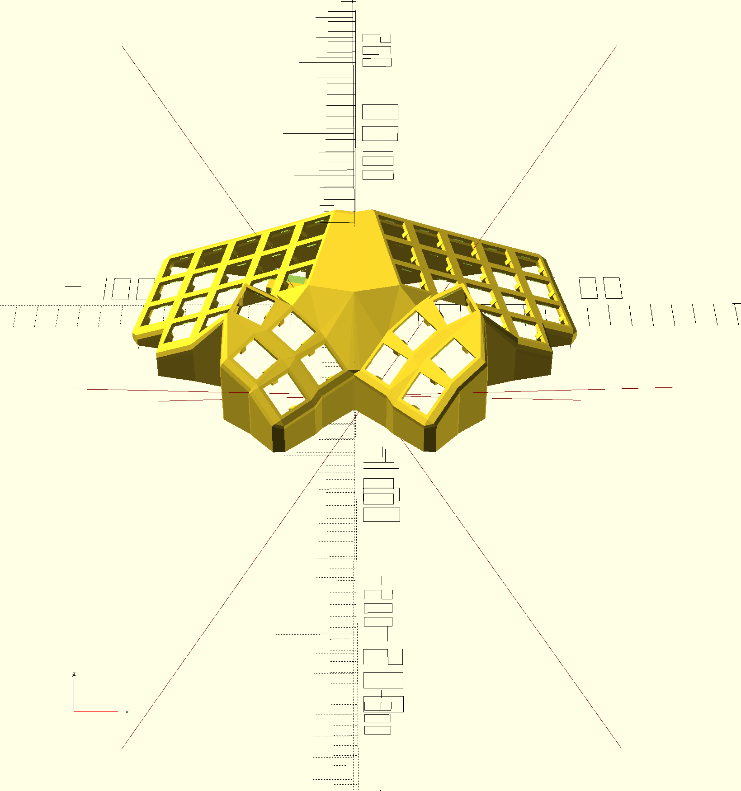
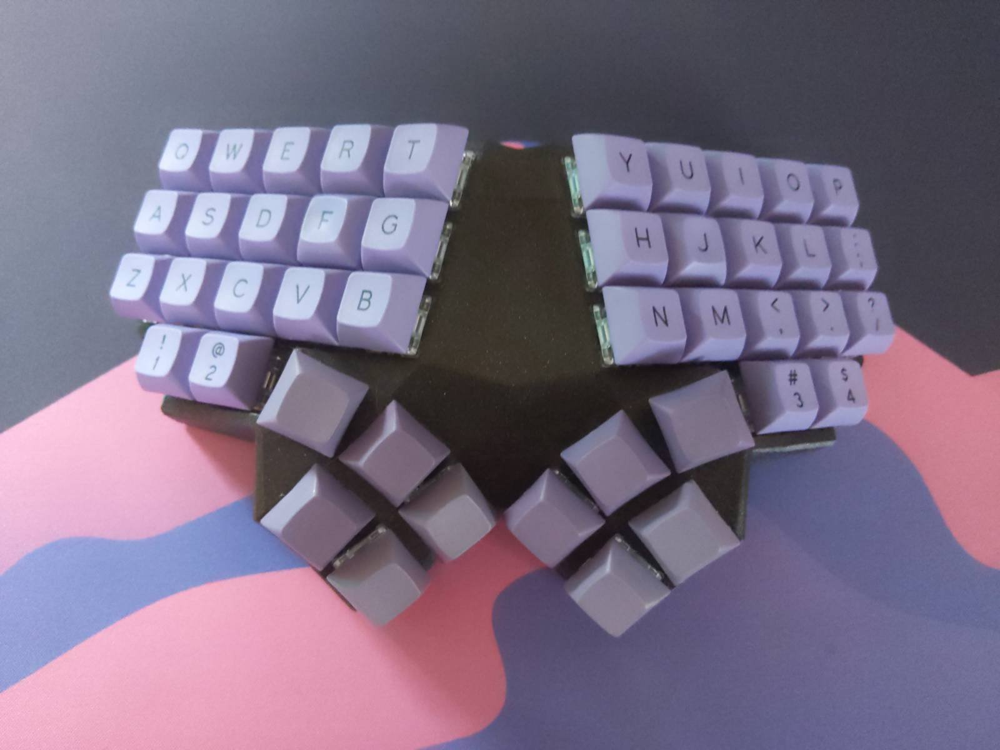

# btrfly





more pictures in `pictures`

This is a fork of the [Dactyl-ManuForm](https://github.com/tshort/dactyl-keyboard). The Dactyl-Manuform is a fork of the [Dactyl](https://github.com/adereth/dactyl-keyboard) with the thumb cluster from [ManuForm](https://github.com/jeffgran/ManuForm).


## Wiring

No "pretty" diagram for now, but there is an ugly hand drawn schematic. see `wiring.jpeg`

The schematic is from the perspective of the underside of the keyboard. 

Most of the "usual" dactyl wiring rules apply here.

ProMicro Pinout
```
C = colomn
R = Row

C0 = D3  USB   RAW
C1 = D2        GND
     GND       RST
     GND       VCC
C2 = D1        F4
C3 = D0        F5
C4 = D4        F6
C5 = C6        F7 = R0
C6 = D7        B1 = R1
C7 = E6        B3 = R2
C8 = B4        B2 = R3
C9 = B5        B6 = R4
```

## Build QMK
copy qmk/microdactyl to a new qmk checkout, under the keybaords/handwired directory
```
cp -a qmk/btrfly $QMK_DIR/keyboards/handwired/
```
then flash by running the following from your qmk checkout
```
make handwired/btrfly:default:flash
```

## Features

- dactyl-manuform-mini thumb cluster
- flat, tented qwerty keys
- 4 extra mappable keys

## Generate OpenSCAD and STL models

* Run `lein generate` or `lein auto generate`
* This will regenerate the `things/*.scad` files
* Use OpenSCAD to open a `.scad` file.
* Make changes to design, repeat `load-file`, OpenSCAD will watch for changes and rerender.
* When done, use OpenSCAD to export STL files


* NOTE: in the code, the btrfly keyboard is sometimes called "squish"

## In the wild
https://old.reddit.com/r/ErgoMechKeyboards/comments/nozw1c/btrfly_with_kissboard_configuration_my_first_diy/

## License

Copyright © 2021 Hal Emmerich
Copyright © 2015-2018 Matthew Adereth, Tom Short and Leo Lou

The source code for generating the models is distributed under the [GNU AFFERO GENERAL PUBLIC LICENSE Version 3](LICENSE).

The generated models are distributed under the [Creative Commons Attribution-ShareAlike 4.0 International (CC BY-SA 4.0)](LICENSE-models).
